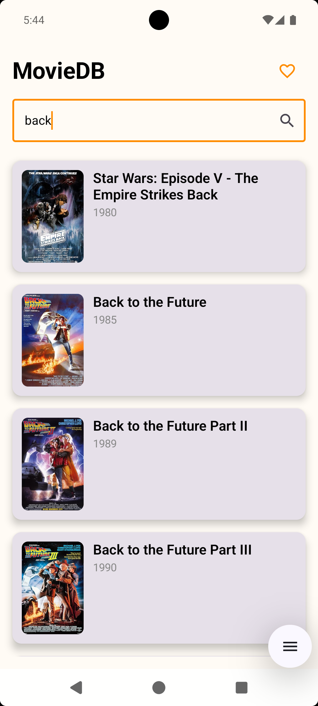
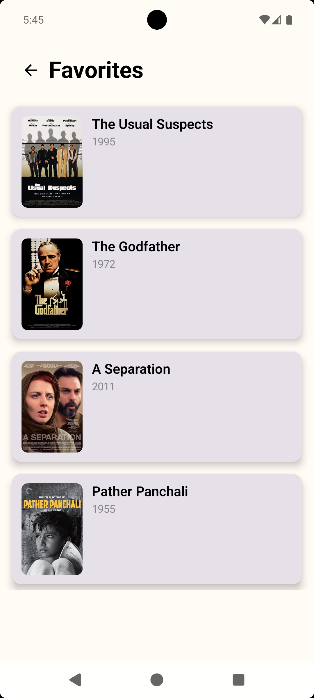

🎬 MovieDB

MovieDB is a modern Android application built with Kotlin and Jetpack Compose that allows users to search movies using the OMDb API, view detailed movie information, and manage a favorites list with local persistence.

The project follows MVVM architecture, uses Retrofit for networking, Room for local storage, Hilt for dependency injection, and includes unit tests covering core business logic and data layers.

## 📱 Screenshots

| Search Screen | Movie Details | Favorites |
|--------------|---------------|-----------|
|  |  |  |

📦 APK

A debug APK is available for quick installation and review:

👉 https://github.com/keyserSoze98/MovieDB/tree/master/apk

✨ Features

🔍 Search movies by title (OMDb API)

🎞 View detailed movie information (plot, rating, cast, director, etc.)

❤️ Add / remove movies from favorites

💾 Favorites persisted locally using Room

⚡ In-memory caching for movie details

🖼 Lazy-loaded and cached images using Coil

🚦 Loading, error, and empty states handled gracefully

🧱 Architecture

The app follows Clean MVVM architecture:

presentation → ViewModels + Compose UI
domain       → UseCases + Models
data         → Repository, API, Room, DTOs

Key Design Choices

Single source of truth via ViewModels

Repository pattern for data abstraction

UseCases for business actions

Dependency Injection via Hilt

State-driven UI with Compose

🛠 Tech Stack

Language: Kotlin

UI: Jetpack Compose + Material 3

Networking: Retrofit + Gson

Image Loading: Coil

Local Storage: Room

DI: Hilt

Concurrency: Kotlin Coroutines

Testing: JUnit4, MockK, kotlinx-coroutines-test

🚀 Setup Instructions
1️⃣ Clone the repository
git clone <repository-url>

2️⃣ Add OMDb API Key

Create or update local.properties in the root directory:

OMDB_API_KEY=your_api_key_here

The API key is injected using BuildConfig and is not hardcoded.

3️⃣ Open & Build

Open the project in Android Studio

Sync Gradle

Run on emulator or physical device (minSdk 24)

The project should compile without errors and run as described.

🧪 Running Unit Tests

Unit tests cover:

Network logic & caching

Business logic and validation

Favorites persistence

Run all unit tests:
./gradlew test

Or directly from Android Studio:

app/src/test/ → Right-click → Run tests

Tested Components

SearchViewModel

MovieRepository

FavoritesRepository

UseCases are thin delegators without conditional logic; therefore, testing repositories and ViewModels provides complete behavioral coverage.

⚡ Performance & Caching

🧠 In-memory caching for movie details to avoid redundant API calls

🖼 Image caching handled automatically by Coil

💾 Local persistence of favorites using Room

🚀 Smooth UI updates via Compose state management

❗ Error Handling

Empty search validation

Network/API error handling

Graceful empty states (e.g., no favorites)

User-friendly feedback messages

🏁 Conclusion

This project demonstrates:

Clean architecture

Modern Android development practices

Thoughtful performance optimizations

Meaningful unit test coverage

Clear documentation and setup instructions
